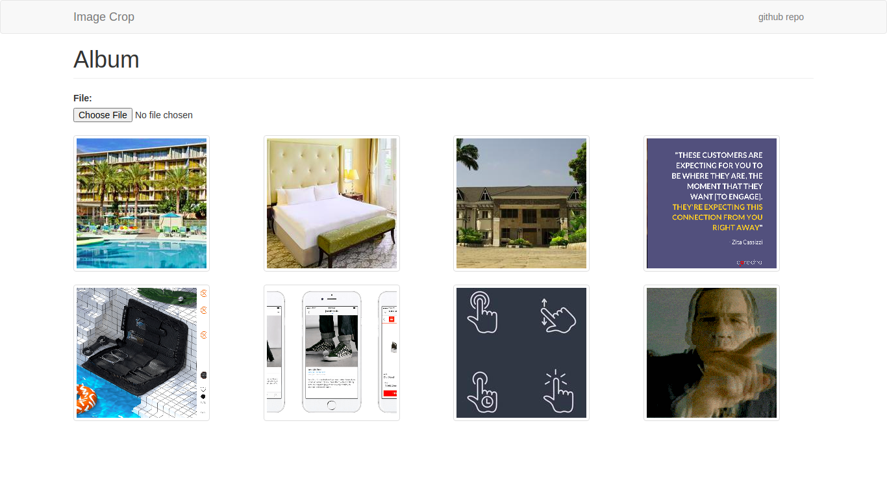

# Django Image Cropper

Cropping images is a fairly common use in a Web application. For example, some applications let you upload a profile picture. In addition, it usually also let you crop and resize the image for a better result. 

Django Image Cropper application allows a user to upload an image, display a preview in a modal, crop the image and finally upload it and save it in the server.

# Demo
Here is a working live demo: https://django-image-cropper.herokuapp.com/ 

## Site
### Landing Page
The [Landing Page](https://django-image-cropper.herokuapp.com/) displays all the cropped images. 

### Image Cropping Modal
Django Image Cropper uses a regular [Bootstrap]() modal to:
1. Preview the selected image
1. Enable the user to interact with the [Cropper](https://github.com/fengyuanchen/cropper/blob/master/README.md) tool, *blue rectangle*

# [Usage](https://django-image-cropper.herokuapp.com/)

## Development
Want to contribute? Great!

To fix a bug or enhance an existing module, follow these steps:

- Fork the repo
- Create a new branch (`git checkout -b improve0feature`)
- Make the appropriate changes in the files
- Add changes to reflect the changes made
- Commit your changes (`git commit -am 'Improve feature'`)
- Push to the branch (`git push origin improve-feature`)
- Create a Pull Request

## Bug / Feature Request

If you find a bug (the website could handle your image and / or gave undesired results), kindly open an issue [here](https://github.com/lwairore/django-image-cropper/issues/new) by including your image and the expected result.

If you'd like to request a new function, feel free to do so by opening an issue [here](https://github.com/lwairore/django-image-cropper/issues/new).

# Technologies used
1. [Python](https://www.python.org/) - General purpose programming language that can be used for developing both desktop and web applications.
2. [Django 1.11](https://www.djangoproject.com/) - Python-based free and open-source web framework, which follows the model-template-view architectural pattern, to ease the creation of complex database-driven applications.
3. [Pillow](https://pillow.readthedocs.io/) - Python Imaging Library for Python Programming language that adds support for opening, manipulating, and saving many different image file formats.
4. [jQuery 3.1.1](https://jquery.com/) - JavaScript library designed to simplify HTML DOM tree traversal and manipulation, as well as event handling, CSS animation, and Ajax.
5. [Cropper](https://fengyuanchen.github.io/cropperjs/) - A simple jQuery cropping plugin.

# [License](LICENSE)

MIT License

Copyright (c) 2019 [Karangu Lucas Wairore](https://github.com/lwairore)
